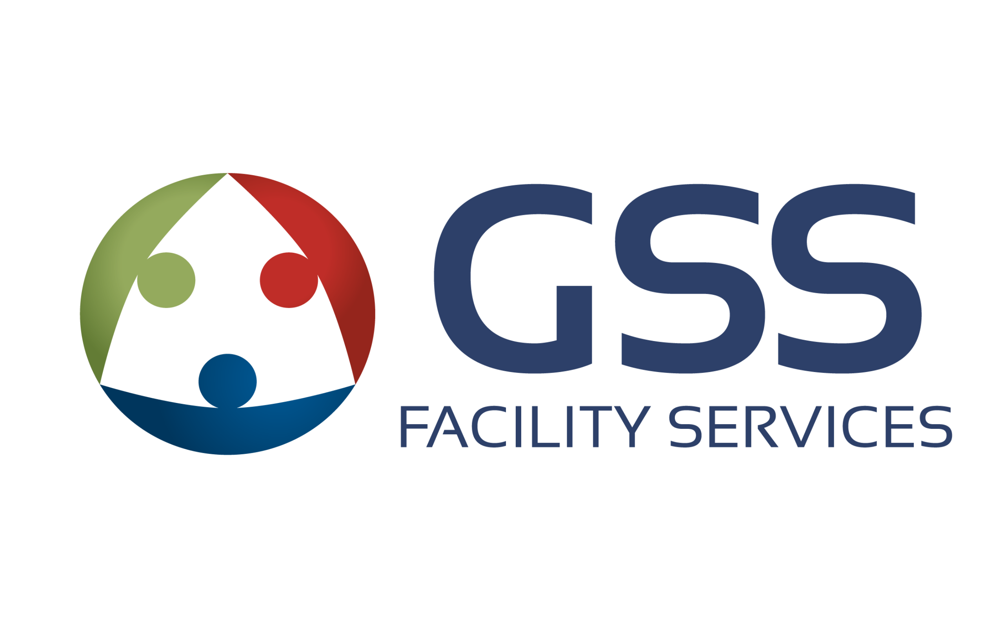

<a name="top"></a>

<p align="center">
  
</p>

<h1 align="center">GSS Centro de Gestión</h1>

<p align="center">
  Portal web interno de <strong>GSS Facility Services</strong> — gestión operativa centralizada para equipos de limpieza, seguridad, logística y administración.
</p>

<p align="center">
  <a href="#inicio-rápido">Inicio rápido</a> ·
  <a href="#módulos-del-sistema">Módulos</a> ·
  <a href="#tecnologías">Tecnologías</a> ·
  <a href="#roles-de-usuario">Roles</a> ·
  <a href="#guías-de-uso">Guías de uso</a> ·
  <a href="#documentación-técnica">Documentación técnica</a> ·
  <a href="#despliegue">Despliegue</a>
</p>

---

## Tiempo en desarrollo

<!-- TIMER-START -->

**Tiempo en desarrollo**: 2 meses · 10 días · 22 horas

| Métrica | Valor |
|---------|-------|
| Primer commit | 2026-02-10 |
| Último commit | 2026-04-23 |
| Commits totales | 474 |
| Horas calendario (desde primer commit) | 1723 h |
| Horas efectivas estimadas | 133 h |

<sub>Horas efectivas = suma de intervalos entre commits con gap ≤ 120 min + 30 min por arranque de sesión. Aproximación basada en git; no contempla trabajo sin commit.</sub>

<!-- TIMER-END -->

---

## Qué es este proyecto

**GSS Centro de Gestión** centraliza en un solo lugar todo lo que necesita el equipo para operar: tickets de soporte, bitácora de novedades, control de asistencia, logística de uniformes, operaciones de limpieza y seguridad, recursos humanos, cotización comercial y mucho más.

Funciona desde cualquier navegador, en celular o computadora, sin necesidad de instalar nada.

<p align="right"><a href="#top">↑ Inicio</a></p>

---

## Inicio rápido

> Requisitos: **Node.js 18+**

```bash
# 1. Clonar e instalar
git clone <repo-url>
cd gss-management-hub
npm install

# 2. Variables de entorno
cp env.local.example .env.local
# Editar .env.local con los valores requeridos (ver el archivo para referencia)

# 3. Cargar datos de prueba (usuarios, tickets, bitácora, asistencia)
npm run seed

# 4. Levantar el servidor de desarrollo
npm run dev
```

Abre [http://localhost:3000](http://localhost:3000) y usa cualquiera de estas credenciales:

| Email | Rol | Accede a |
|-------|-----|----------|
| `admin@example.com` | Administrador | Todo el sistema |
| `jefe@example.com` | Jefe | Dashboard, tickets, reportes |
| `supervisor@example.com` | Supervisor | Tickets, bitácora, operaciones |
| `funcionario1@example.com` | Funcionario | Registro de tareas propias |
| `tecnico@example.com` | Técnico | Seguridad electrónica |
| `logistica@example.com` | Logística | Módulo de logística completo |
| `contador@example.com` | Contador | Cotización y liquidación |
| `rrhh@example.com` | RRHH | Agenda web de uniformes |
| `encargado@example.com` | Encargado limpieza | Operaciones del cliente asignado |

**Contraseña para todos:** `Dev1234!`

> Para limpiar y regenerar los datos: `CLEAN=1 npm run seed`

<p align="right"><a href="#top">↑ Inicio</a></p>

---

## Módulos del sistema

### Tickets (Mesa de Ayuda)
Canal para reportar y gestionar incidencias y solicitudes. Cada ticket tiene seguimiento completo: comentarios internos, archivos adjuntos, colaboradores, historial de cambios y notificaciones automáticas por correo y celular.

### Bitácora
Registro diario de novedades operativas. Los supervisores documentan inspecciones, incidentes y el estado del personal en cada cliente. Exportable a Excel con colores por sector.

### Mi Trabajo / Registro de Tareas
Los trabajadores registran sus tareas del día indicando cliente y sector. El sistema calcula la asistencia automáticamente a partir del primer y último registro, sin necesidad de fichar.

### Panel de Administración
Tablero con métricas generales: tickets pendientes, resueltos, tiempo promedio de resolución y distribución por prioridad. Vista exclusiva para administradores y jefes.

### Operaciones Limpieza
Gestión del personal de limpieza y seguridad: informes de presencia con firma digital, asignación de tareas, historial, gestión de personal y solicitudes de uniformes. Incluye un editor de planillas configurable por el administrador.

### Logística
Administración integral de uniformes: agenda web de entregas por empleado, seguimiento de envíos al interior del país, órdenes de compra con lectura automática de PDF, y calendario de eventos logísticos. Incluye **historial por empleado** (buscando por cédula se ven todas sus citas, intentos fallidos, canceladas y entregas completadas) y **reasignación de turno** desde la finalización de entrega cuando un empleado viene fuera de su turno original.

### Registro de Limpieza
Pantalla pública (sin contraseña) donde el personal de limpieza confirma sus tareas del día con foto como evidencia, usando solo su número de cédula.

### Turno — Agenda Web de Uniformes (pública)
Pantalla pública donde cualquier empleado puede consultar si tiene un turno de entrega de uniforme asignado, ingresando su número de cédula.

### Seguridad Electrónica
Módulo para técnicos: registro de eventos de monitoreo y gestión de mantenimientos preventivos y correctivos en instalaciones de los clientes.

### Cotización
Gestión comercial y liquidación de horas: categorías de empleados, tarifas por hora, períodos de facturación y exportación de reportes Excel para clientes.

### Recursos Humanos (RRHH)
Acceso al sistema de gestión de uniformes desde el área de RRHH. Permite consultar y registrar entregas al personal.

### Mi Trabajo (Mitrabajo)
Descarga automática diaria del reporte de asistencia desde el portal externo mitrabajo.uy. Los archivos quedan disponibles para descarga directa desde el sistema y, opcionalmente, se envían por email como adjunto a los destinatarios configurados en la misma sección.

### Administración de Usuarios
Gestión completa de cuentas: aprobar registros nuevos, crear usuarios manualmente, asignar roles y módulos, bloquear accesos y administrar el personal de campo (funcionarios).

### Configuración del Sistema
Gestión de clientes (ubicaciones) y sus sectores, configuración de notificaciones por departamento e integración con servicios externos.

<p align="right"><a href="#top">↑ Inicio</a></p>

---

## Tecnologías

| Área | Tecnología |
|------|------------|
| Frontend | Next.js 16 (App Router), React |
| Backend | API Routes (Next.js), Node.js |
| Base de datos | SQLite (desarrollo local) / PostgreSQL (producción) |
| Autenticación | JWT (sesión por token) |
| Notificaciones | Web Push (VAPID), correo SMTP, Power Automate |
| Almacenamiento de archivos | Sistema de archivos local / Cloudinary |
| Automatización | Playwright (descarga mitrabajo), node-cron |
| Exportaciones | ExcelJS / SheetJS |
| Deploy | Railway (PaaS) + Docker |

<p align="right"><a href="#top">↑ Inicio</a></p>

---

## Roles de usuario

| Rol | Acceso principal |
|-----|-----------------|
| Administrador | Todo el sistema |
| Jefe | Su departamento completo |
| Supervisor | Tickets, Bitácora, operaciones |
| Funcionario | Registro de tareas propias |
| Técnico | Seguridad electrónica |
| Logística | Módulo de logística completo |
| Contador | Cotización y liquidación |
| RRHH | Agenda web de uniformes |
| Encargado de limpieza | Operaciones limpieza (cliente asignado) |
| Limpieza | Registro de limpieza (pantalla pública) |

<p align="right"><a href="#top">↑ Inicio</a></p>

---

## Guías de uso

Documentación escrita para usuarios sin conocimientos técnicos.

| Guía | Módulo |
|------|--------|
| [Usuarios y Roles](./docs/guias/GUIA_USUARIOS.md) | Registro, login, tipos de usuario |
| [Administradores](./docs/guias/GUIA_ADMINISTRADORES.md) | Gestión de usuarios y sistema |
| [Tickets](./docs/guias/GUIA_TICKETS.md) | Mesa de ayuda, estados, colaboradores |
| [Mi Trabajo / Asistencia](./docs/guias/GUIA_ASISTENCIA.md) | Registro de tareas y asistencia |
| [Bitácora](./docs/guias/GUIA_BITACORA.md) | Novedades, exportación, estadísticas |
| [Configuración Personal](./docs/guias/GUIA_CONFIGURACION.md) | Tema, notificaciones push |
| [Panel de Administración](./docs/guias/GUIA_ADMINISTRACION_DASHBOARD.md) | Métricas y gestión de tickets |
| [Operaciones Limpieza](./docs/guias/GUIA_OPERACIONES_LIMPIEZA.md) | Informes, tareas, personal, uniformes |
| [Logística](./docs/guias/GUIA_LOGISTICA.md) | Agenda web, envíos, órdenes de compra |
| [Seguridad Electrónica](./docs/guias/GUIA_SEGURIDAD_ELECTRONICA.md) | Monitoreo y mantenimiento |
| [Cotización](./docs/guias/GUIA_COTIZACION.md) | Tarifas, liquidación, reportes |
| [RRHH](./docs/guias/GUIA_RRHH.md) | Agenda web de uniformes |
| [Gestión de Usuarios (Admin)](./docs/guias/GUIA_ADMIN_USUARIOS.md) | Alta, edición, permisos, funcionarios |
| [Configuración del Sistema (Admin)](./docs/guias/GUIA_ADMIN_CONFIG.md) | Ubicaciones, sectores, herramientas |
| [Registro de Limpieza](./docs/guias/GUIA_REGISTRO_LIMPIEZA.md) | Pantalla pública con cédula |
| [Turno / Agenda Uniformes](./docs/guias/GUIA_TURNO.md) | Consulta pública de turno |

<p align="right"><a href="#top">↑ Inicio</a></p>

---

## Documentación técnica

| Documento | Contenido |
|-----------|-----------|
| [Distribución de código](./docs/ESTRUCTURA.md) | Qué hace cada archivo y carpeta del proyecto |
| [Despliegue en Railway](./docs/DEPLOYMENT_QUICKSTART.md) | Guía rápida de deploy |
| [Respaldos](./docs/BACKUPS.md) | Procedimientos de backup |

<p align="right"><a href="#top">↑ Inicio</a></p>

---

## Despliegue

El sistema está preparado para desplegarse en **Railway** con PostgreSQL como base de datos de producción. Ver [DEPLOYMENT_QUICKSTART.md](./docs/DEPLOYMENT_QUICKSTART.md) para los pasos detallados.

```bash
# Build para producción
npm run build
npm start

# Docker (opcional)
docker compose up -d --build
```

<p align="right"><a href="#top">↑ Inicio</a></p>
